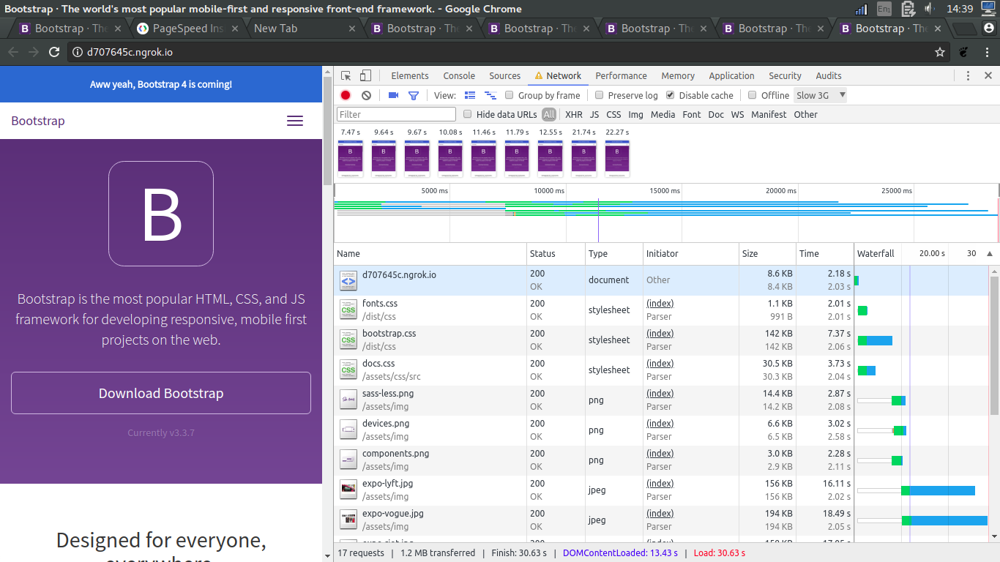
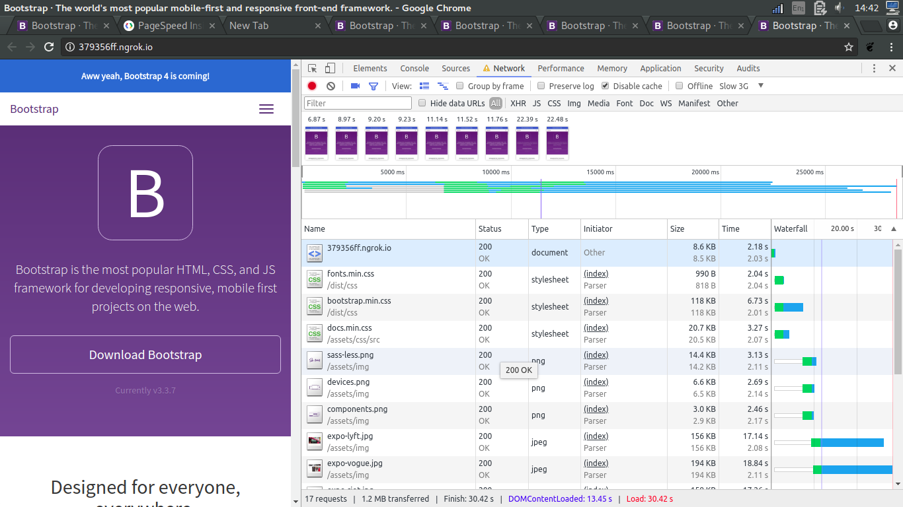
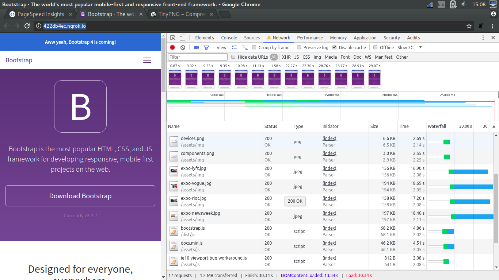
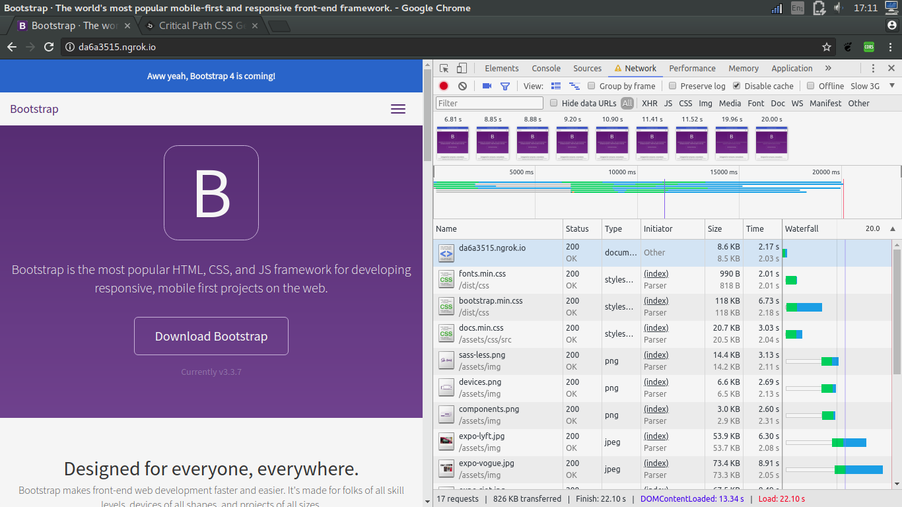
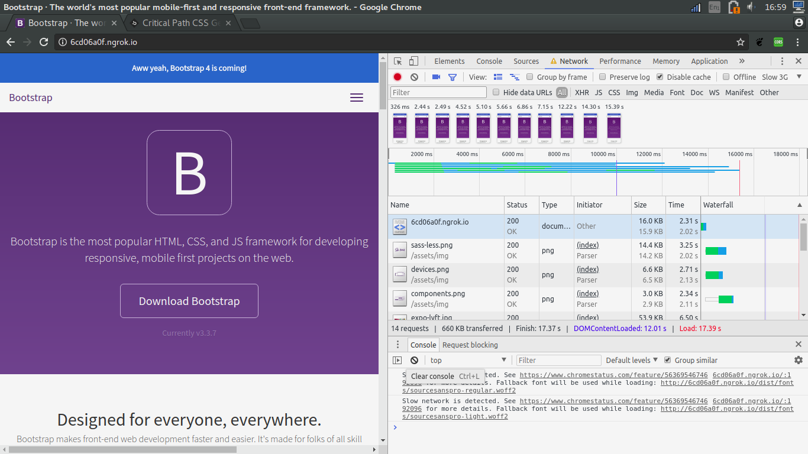

# Audit

## Step 1: Minifying css
https://cssminifier.com/
I noticed that the CSS was blocking, and https://developers.google.com/speed/ indicated that minifying the css would improve the rendering

Statistics: 
* Fonts.css 2.01s
* bootstrap.css 7.37s
* docs.css 3.73s
> First render 7.47s

Statistics: 
* Fonts.min.css 2.04s(+0.03s)
* boostrap.min.css 6.753s
* docs.min.css 3.27s
> First render 6.87s

minifying the CSS had a noticeable positive impact on both the overall rendering as the initial render.
Consider using something like https://www.npmjs.com/package/uglifycss for node projects to automate this process.

## Step 2: Minifying images
Tool used to minify: https://tinypng.com/

Statistics: 
* expo-lyft.jpg 2.08s
* expo-vogue.jpg 2.05s
* expo-riot.jpg 2.08s
* expo-newsweek.jpg 2.11s
> First render 6.87s
Total time: 30.34s  

![after-minifyin-img]
(auditimg/b4-images.png)
Statistics:
* expo-lyft.jpg 2.11s
* expo-vogue.jpg 2.11s
* expo-riot.jpg 2.11s
* expo-newsweek.jpg 2.11s
> First render 6.83s
Total time: 22.18s  
This one i don't fully understand, even though the image times didn't go down drastically, the total time did. The render time also slightly improved, but without a big impact. 

In the future for node projects, a package like https://www.npmjs.com/package/image-min could be relevant to automate the process. 

## Step 3: Minify javascript
Tool used to minify: https://jscompress.com/  

['Javascript'](auditimg/before-js-minifying.png)
Statistics:
* bootstrap.js 2.02s 68.1KB
* ie10-viewport-bug-workaround.js 2.08s 641B
> First render 6.81s
Total time 22.18s

['javascript-minifying'](auditimg/after-js-minifying.png)
* bootstrap.js 2.02s 36.0KB
* ie10-viewport-bug-workaround.js 2.08s 0B
> First render 6.82s
Total time 21.76s 

Advise: For minification purposes, a NPM minifier is recommended. This way, all files should be minified without this requiring manual labor. Note that not all CSS or javascript files arent included, as these aren't within the audit scope. For this demo just the rendered files on the homepage are minified.  

## Step 4: Critical CSS[Initial page]
Tool used to calculate critical CSS: https://jonassebastianohlsson.com/criticalpathcssgenerator/ 

Statistics:
* fonts.min.css 990b 2.02s (TTFB 2.02s), actual download 1.64ms
* bootstrap.min.css 6.6kb (TTFB 2.04s), actual download 292.53 ms 
* docs.min.css (TTFB 2.08s), actual download 909.60 ms
> First render 6.81s
Total time 22.18s

HTML became 16.0kb, and took a total of 2.31s to load. The first render shot up, making the perceived render 'instant'. The html file however, is above the recommended 14kb so it needs 2 tcp cycles, but this seems worth it looking at the results 
> First render 326ms
total time 17.37s

Used a trick   `<link rel="stylesheet" href="/dist/css/fonts.min.css" media="none" onload="if(media!='all')media='all'"><noscript><link rel="stylesheet" href="css.css"></noscript>` to load the css without it being render blocking. In this demo the loading of the css might still be slow for subpages, as caching is something that is done server side, and seems out of scope for this assignment. 

Consider using something like https://github.com/addyosmani/critical to semi-automate this process. 

## Step 5: deffering Javascript
I noticed that the javascript wasn't being deffered. It wasn't parsing blocking but it wouldn't hurt to deffer it anyways.

What's really interesting to note is that the load time noteablly degraded for all the files, even jquery, which I didn't even defer. 
It also slowed the dom loading down by 4 seconds, which seems problematic. So i wouldn't recommend it in this case.

## Step 6: Loading fonts
Technique used: https://medium.com/@matuzo/getting-started-with-css-font-loading-e24e7ffaa791

Even though the loading of the fonts now start earlier, the font is still way too big to be reasonable to use in it's current state. Alternatives would be to look at the google api https://fonts.google.com/specimen/Source+Sans+Pro?selection.family=Open+Sans, use a system font or depend on server caching, but i wouldn't suggest using it in it's current state. 